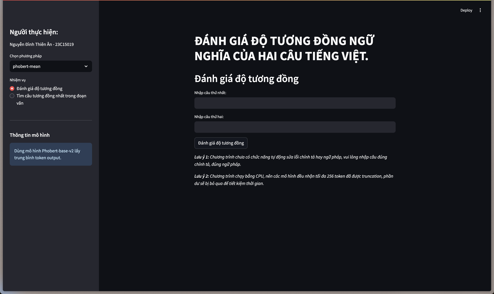
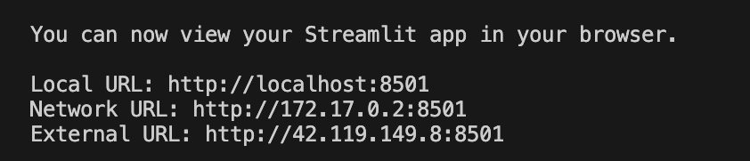

## 0. CHƯƠNG TRÌNH


## 1. CÀI ĐẶT
### a.  Mặc định

Điều kiện môi trường: Java 1.8+ (JRE hay JDK)

```pip install -r requirements.txt```

### b.  Sử dụng Docker

```docker build . -t /tên môi trường/```

## 2. SỬ DỤNG
### a. Mặc định
```python run.py```
### b. Qua Docker
```docker run -p 8000:8000 -p 8501:8501 /tên môi trường/```

Sau đó truy cập vào đường dẫn Local URL như hình:


## 3. ĐÁNH GIÁ CÁC MÔ HÌNH
Tập dữ liệu được dùng để đánh giá: [vi-stsbenchmark](https://huggingface.co/datasets/doanhieung/vi-stsbenchmark) - tập này các mô hình đều chưa học.
```python ./src/evaluate.py```

Ngoài ra, nếu muốn đánh giá trên tập dữ liệu khác, truy cập vào file **src/evaluate.py**, chỉnh sửa cho phù hợp các dòng sau:

```
DATA_PATH = os.path.join(os.path.dirname(os.path.dirname(os.path.abspath(__file__))), 'data') 
vi_sts = load_dataset(DATA_PATH)['train'] \
df_test = vi_sts.filter(lambda example: example['split'] == 'test')\
data_name = 'vi-sts-test'
```

và hàm

```
def convert_dataset(dataset):
    dataset_samples = []
    for df in dataset:
        score = float(df['score']) / 5.0
        input_example = InputExample(
                texts = [
                        tokenize(df['sentence1']), 
                        tokenize(df['sentence2'])], 
                label = score)
        
        dataset_samples.append(input_example)
    return dataset_samples
```